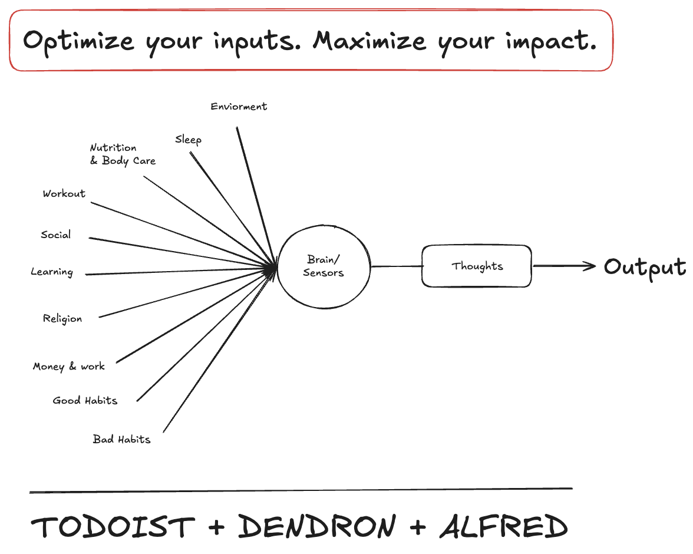

# 👋 Hi, I’m Marwan — I like math, coding and art.

I want to be able to create an immersive digital experiences - crafting spaces and filling them with intelligence, emotion and meaning. My love for math, technology and art drives me to create something meaningful at their intersection — and one day, I will.

<!--  -->

  

## Math Stack
- Linear Algebra (My favorite)
- Multivariate Calculus
- ODEs PDEs
- Probability & Statistics
- Geometry & Trigonometry

## Tech Stack
I have experience with a wide range of technological frameworks and concepts, but my primary focus—and what I consistently strive to deepen—is centered around the tools and technologies listed below.

### Model Development

### Application Development

### Infrastructure

### Soft Skills
 
 
 
 
 
 

 

## View Your Brain as a Factory
The goal in life is to optimize your inputs to maximize your impact. While the input areas I’ve outlined may not capture the entire space of possibilities—and circumstances naturally vary from person to person—I believe this core principle holds true for everyone. To effectively manage this wide array of inputs, we all need a second brain system—one that combines both task management and knowledge organization. Personally, I rely on Todoist for structured execution and Dendron for organizing and evolving my thoughts.

  

## I like to:
- Spend each morning after breakfast working on a project or learning something I love at my favorite library or café.
- Teach. Its a rewarding experience.
- Go to the Gym
- Eat Delicious Food
- Play Paddle, tennis table, volleyball
- Socialize (sometimes <.<)
- Board games and coop games

## Favorite
- Movies: Arrival, WALL·E
- Sci-fi series: Iain M. Banks’ The Culture Series.

## Some of My Dreams & Goals
- To have an apartment with passionate people by the shore and work on meaningful tech solutions every day.
- To apply some of the ideas from Iain M. Banks’ The Culture Series.
- To achieve financial freedom that allows me to fully focus on learning and building the things I want to.
